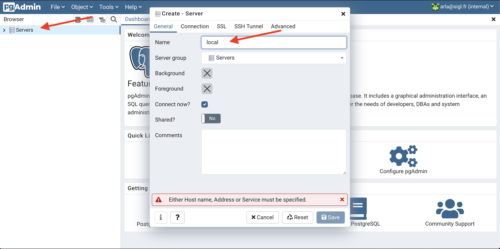
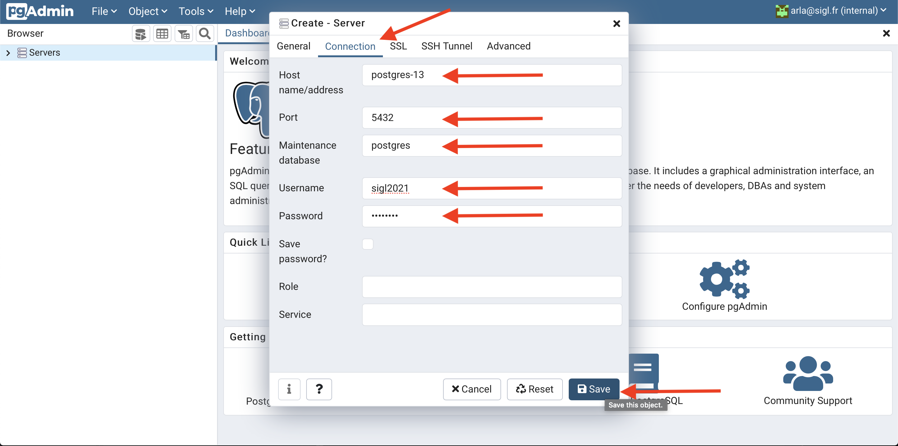
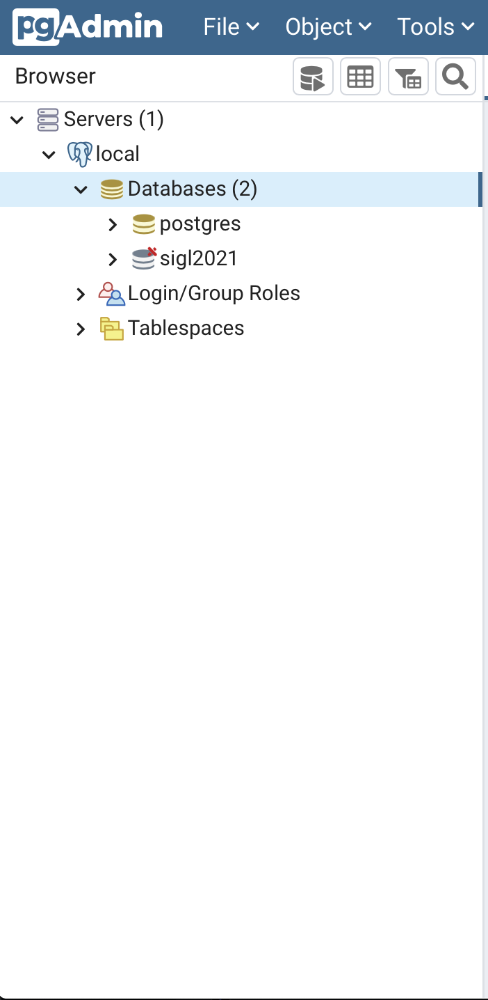
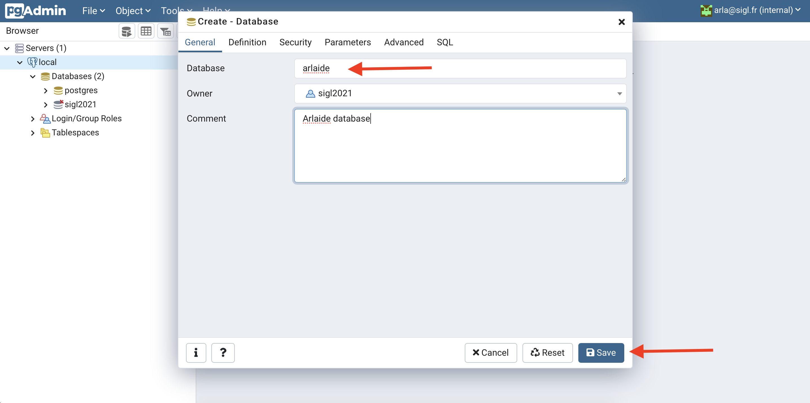
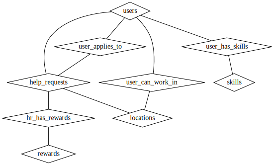

# Postgres (or PostgreSQL) workshop

[Postgres](https://www.postgresql.org) is an open source relationnal database managment system (RDBMS).

It's totally free and is use in production by many. This is the brother of MySQL/MariaDB.

In this workshop, you will:
- create Arlaide's database schema
- import test data
- visualize this data using [pgAdmin](https://www.pgadmin.org)
- query some data from the web API of the former workshop

## Step 1: Run Postgres and pgadmin on your computer

Postgres is your relationnal database where pgAdmin is a simple UI to help you manage your database (query, table creation etc...).

Instead of installing directly Postgres and pgAdmin on your local machine, you will run those in containers.

### docker-compose, docker network and docker volumes

You will use another tool in the docker world: [docker-compose](https://docs.docker.com/compose/).

`docker-compose` is a CLI tool that allows you to run multiple containers, describe in a `docker-compose.yaml` (or `docker-compose.yaml`)file.

We've created the [docker-compose.yaml](./docker-compose.yaml) for you.

Because pgAdmin docker image needs to access postgres docker image, they need to be on the same [docker network](https://docs.docker.com/network/).

First, create a new external docker network for postgres:
```sh
# creates the postgres docker network
docker network create arlaide-postgres
```

Second, create two [docker volumes](https://docs.docker.com/storage/volumes/):
- postgres-data: to store postgres data to avoid losing it every time your restart postgres container
- pgadmin-data: to store pgAdmin configurations, to avoid losing your config every time you restart pgAdmin container

```sh
# create postgres-data volume
docker volume create postgres-data
# create pgadmin-data volume
docker volume create pgadmin-data
```

Then, you can just run containers describe in `docker-compose.yaml` by typing:
```sh
# start containers describe in the docker-compose.yaml file
# in daemon mode. Meaning, you'll start your containers in background
docker-compose up -d
# Creating pgadmin4    ... done
# Creating postgres-13 ... done
```

Check if your containers are running:
```sh
docker ps
# you should see your two containers in the list
```

> Note: if you need to redo or delete evrything:
> - `docker-compose down` will remove all running container but NOT volumes and network, since they are external
> - `docker volume rm postgres-data` to delete postgres data
> - `docker volume rm pgadmin-data` to delete pgadmin data
> - `docker network rm arlaide-postgres` to delete postgres's docker network

### Connect to your database with pgAdmin

You should be able to access PgAdmin on [locahost:8040](http://localhost:8040/)
- usermail: arla@sigl.fr
- password: sigl2021

For PostgreSQL instance running locally, credentials are:
- user: sigl2021
- password: sigl2021

> Note: default credentials are in the docker-compose file

Once logged in add the local PostgreSQL:

1. Add server: right click on Servers > Add server

2. Enter a connection name (e.g. local)



3. Add the postgres containers info (user, password are both sigl2021)



4. You should see postgres schema and sigl2020 schema in the server dropdown:



## Step 2: Create Arlaide's database schema

First, let's create a database named `arlaide`, using pgAdmin:
- right click on `Databases` under Server > local
- select `Create`
- just set the name to `arlaide` and some comment if you want.
> Note: if you currious about how to do it in raw SQL, you can see real SQL code in the SQL tab
- click `Save`


Then, let's create Arlaide's database core schema, with the following specifications:
- A **user** has one or more **skills**.
- A **skill** express what the a **user** is good at.
- A **user** creates **help requests** at a given date and time.
- A **user** can apply to one or more **help_requests**
- A **help request** is associated to a single **location** .
- A **user** can work in one or many **location**.
- A **help request** has one or more **reward**.
- A **reward** can be money in a specific currency and/or arlaide coins. The more arlaide coins  a user has, better his chance of getting selected for a request.

Here is the corresponding entity-relation diagram (ERD), without table attributes:



We've prepared a script to create those tables: [create-table.sql](./scripts/create-tables.sql).

To run it, you need to send it to your docker container and run a `psql` command from there:
```sh
# First copy the `create-table.sql` script to your running postgres container
docker cp ./scripts/create-tables.sql postgres-13:/tmp/
# create tables by running the create-table scripts over
# your arlaide database
docker exec -it postgres-13 psql -U sigl2021 -d arlaide -f /tmp/create-tables.sql
```

You should see your tables in pgAdmin, under:
Server > local > databases > arlaide > Schemas > public > Tables

Now we've created all tables, we need to add some data to it.

## Step 3: Import test data to your database

You will use the [COPY](https://www.postgresql.org/docs/12/sql-copy.html) command of postgres to import some data that we provided you with.

All test data lives under this `scripts/data` folder. We took some open dataset of:
- 30k [job offers in australia on data.world](https://data.world/promptcloud/30000-job-postings-from-seek-australia/workspace/file?filename=seek_australia.csv)
- 1000 [usernames on data.world](https://data.world/pmlandwehr/metafilter-infodump-20170312/workspace/file?filename=usernames.csv)
- 20+ [skills from top 10 Linkedin's skill over years on data.world](https://data.world/dataremixed/linkedin-top-10-skills-by-year/workspace/file?filename=LinkedInTopSkills.xlsx)

With those 3 datasets, we generated CSV files for all of the tables.

To import it to your postgres database:
1. copy the content of the `scripts` folder inside your running postgresql container:
```sh
docker cp scripts postgres-13:/tmp/
```
2. import the csv file to your `arlaide` database:
```sh
# execute the SQL script to import data from CSV files (see. scripts/load-data.sql)
docker exec -it postgres-13 psql -U sigl2021 -d arlaide -f /tmp/scripts/load-data.sql
```

> Note: if you need to restart from fresh, you just need to type the following:
> ```sh
> # make sure you have scripts files
> docker cp scripts postgres-13:/tmp/
> # create tables (script will first drop tables then create them again)
> docker exec -it postgres-13 psql -U sigl2021 -d arlaide -f /tmp/scripts/create-tables.sql
> # load data from CSV files
> docker exec -it postgres-13 psql -U sigl2021 -d arlaide -f /tmp/scripts/load-data.sql
> ```

## Step 4: Create views on your data for your web API

To explore your data, you can directly query some rows using pgAdmin's UI on http://localhost:8040 
> Make sure to refresh tables from the UI after creating tables or loading data with scripts

Let's select all help_requests with their owners, with the following column names:
- owner_id: user id of the owner of the help request
- owner_username: the username of the owner of the help requests
- help_request_id: the id of the help request
- title: the help request title
- details: the help request details
- city: the city where help is needed
- country: the country where help is needed

Try out the following query from the query tool of pgAdmin:
```sql
 SELECT u.id AS owner_id,
    u.username AS owner_username,
    hr.id AS help_request_id,
    hr.title,
    hr.details,
    l.city,
    l.country
   FROM users u,
    help_requests hr,
    locations l
  WHERE (hr.user_id = u.id) AND (hr.location_id = l.id);
```

> Note: We could have use an INNER JOIN too. see: https://www.postgresql.org/docs/13/tutorial-join.html

This example is rather simple, but imagine now you got more complex queries with more than one join.

Now, you don't want to have to write those complicated queries in your web API code. 

You can create a [view](https://www.postgresql.org/docs/9.2/sql-createview.html).


From your pgAdmin UI, create a view from the "View" tab:
- Name: user_help_requests
- In the `Code` tab, just copy/paste the previous `SELECT` statement (without ending `;`)
- Save your view

Now you can directly query your view by typing:
```sql
SELECT * FROM help_requests_owners;
```

> Note: VIEW and MATERIALIZED VIEWS are differents. MATERIALIZED VIEWS is a PostgreSQL only feature where VIEW are default SQL views.
> You can read more here: https://www.postgresql.org/docs/9.3/rules-materializedviews.html


## Step 5: Consume your view from your web API

From your API, you need to install a new node module to interact with Postgres: [node-postgres](https://node-postgres.com)

To install it, like any other node modules, type:
```sh
# from your web api repository
npm i --save pg
# install typescripts types
npm i --save-dev @types/pg
```

Now you will add after the `FakeDB`, this `RDS` namespace:
```ts
export type UserHelpRequest = {
    help_request_id: number;
    owner_id: number;
    owner_username: string;
    title: string;
    details: string;
    city: string;
    country: string;
}

/**
 * Connects to your Postgres database.
 * RDS stands for Relational Database System, which is a common designation
 * for SQL database like Postgres.
 */
export namespace RDS {
    // Create a pool of connection;
    // to control number of concurrent connections.
    // We leave default values for now.
    const pool = new Pool({
        host: "localhost",
        port: 5432,
        database: "arlaide",
        user: "sigl2021",
        password: "sigl2021"
    });

    // Handler method to perform any kind of query 
    // to your database
    const query = async <T>(sql: string): Promise<T[]> => {
        let result: QueryResult<T>;
        
        // Get the next connection available in the pool
        const client = await pool.connect()
       
        result = await client.query<T>(sql)
        
        // release the connection
        client.release();
        return result.rows;
    }
    
    /**
     * Get next 
     * @param page page number of help requests we want to query
     * @param limit the size of the page of help requests we want to query
     */
    export const getHelpRequests = async (page: number, limit: number) => {
        const helpRequests: UserHelpRequest[] = await query<UserHelpRequest>(`
            SELECT * FROM help_requests_owners
            LIMIT ${limit} OFFSET ${page};
        `)

        return helpRequests;
    }
}
```

This new namespace will expose a `getHelpRequests` method that will query the view of Step 4 (on your localhost).

Then, you just need to adapt your `/v1/help_requests` route to use `RDS.getHelpRequests(...)` instead of `FakeDB.getHelpRequest(...)`:
```ts
// From src/server.ts file
//...
import { /*...*/, RDS, UserHelpRequest } from "./db";
//...
app.get(
  "/v1/help-request",
  /* jwtCheck ,*/ // Remove the security
  async (request: express.Request, response: express.Response) => {
    // Getting value of page and limit query options:
    // ex: http://<domain>/v1/help-request?page=1&limit=10
    //  page == 1
    //  limit == 10
    try {
      const { page, limit } = extractPageOptions(request);

      // Query the page of help requests from the fake database
      const helpRequests: UserHelpRequest[] = await RDS.getHelpRequests(page, limit);

      // sends the response back to the client, when node will be ready!
      response.send(helpRequests);
    } catch (e) {
      // Something went wrong internally to the API,
      // so we are returning a 500 HTTP status
      response.statusCode = 500;
      response.send({ error: e.message });
    }
  }
);
```
> We  disable security on the /v1/help_request route to try out locally. This is not good for production!

Try out and call your API from your browser: http://localhost:3000/v1/help-request?page=1&limit=5

You should see 5 of help requests from your Postgres database.

Once it works, you can put back the security check on your route:
```ts
// From src/server.ts file
app.get(
  "/v1/help-request",
  jwtCheck,
  async (request: express.Request, response: express.Response) => {
  //...
```

## Step 6: Adapt your frontend

The type of a help request has changed:
```ts
// Before
export type HelpRequest = {
    id: string;
    username: string;
    description: string;
    location: string;
}
// Now
export type UserHelpRequest = {
    help_request_id: number;
    owner_id: number;
    owner_username: string;
    title: string;
    details: string;
    city: string;
    country: string;
}
```

So you need to adapt the component that renders a help request to this new type.

For instance, in the [group 11](https://github.com/ffauchille/arla-group-11), we use the [Table from material UI](https://material-ui.com/components/tables/).

So the component which renders the table needs to move from:
```tsx
const HelpRequestTable: React.FC<HelpRequestTableProps> = ({
  helpRequests,
}) => {
  return (
    <TableContainer component={Paper}>
      <Table>
        <TableHead>
          <TableRow>
            <TableCell>Help request ID</TableCell>
            <TableCell align="right">Location</TableCell>
            <TableCell align="right">Description</TableCell>
          </TableRow>
        </TableHead>
        <TableBody>
          {helpRequests.map((hr, index) => (
            <TableRow key={index}>
              <TableCell component="th" scope="row">
                {hr.id}
              </TableCell>
              <TableCell align="right">{hr.location}</TableCell>
              <TableCell align="right">{hr.description}</TableCell>
            </TableRow>
          ))}
        </TableBody>
      </Table>
    </TableContainer>
  );
};
```
to: 
```tsx
const HelpRequestTable: React.FC<HelpRequestTableProps> = ({
  helpRequests,
}) => {
  return (
    <TableContainer component={Paper}>
      <Table>
        <TableHead>
          <TableRow>
            <TableCell>From user</TableCell>
            <TableCell align="right">Title</TableCell>
            <TableCell align="right">Details</TableCell>
            <TableCell align="right">City</TableCell>
            <TableCell align="right">Country</TableCell>
          </TableRow>
        </TableHead>
        <TableBody>
          {helpRequests.map((hr, index) => (
            <TableRow key={index}>
              <TableCell component="th" scope="row">
                {hr.owner_username}
              </TableCell>
              <TableCell align="right">{hr.title}</TableCell>
              <TableCell align="right">{hr.details}</TableCell>
              <TableCell align="right">{hr.city}</TableCell>
              <TableCell align="right">{hr.country}</TableCell>
            </TableRow>
          ))}
        </TableBody>
      </Table>
    </TableContainer>
  );
};
```
